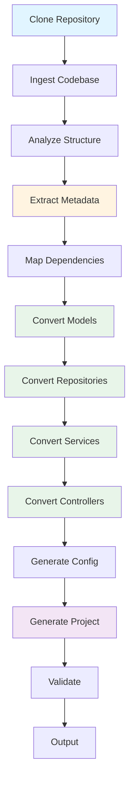
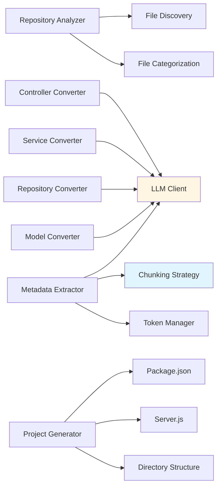
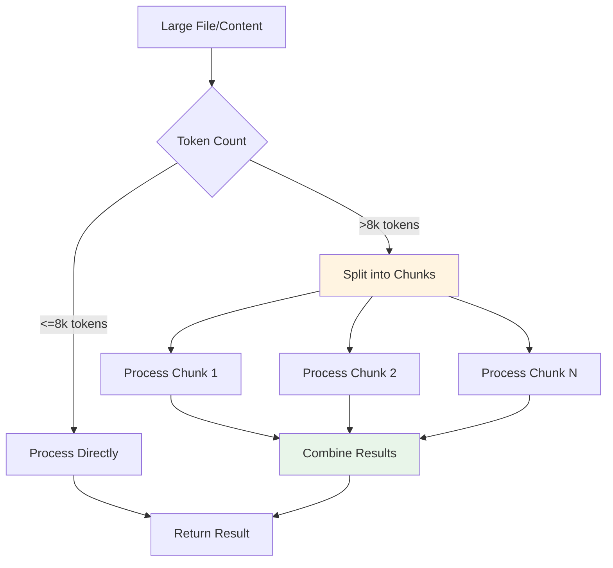

# Converted Node.js Project

---

## Solution Overview

This project was automatically generated by converting a Java Spring Boot application to Node.js using 
an AI-powered conversion agent. The conversion process preserves the original application's structure, 
business logic, and functionality while adapting it to Node.js and Express.js patterns.

### Key Features

- ✅ **Complete Architecture Conversion**: Controller → Service → Repository pattern preserved
- ✅ **Database Integration**: JPA entities converted to Sequelize models with relationship mapping
- ✅ **API Compatibility**: Spring REST controllers converted to Express.js routes
- ✅ **Business Logic Preservation**: Service layer logic translated to async/await patterns
- ✅ **Structured Metadata**: Full project analysis with method signatures, complexity, and dependencies
- ✅ **Production Ready**: Includes error handling, middleware, and configuration files

### High-Level Conversion Process

The conversion follows these steps:

1. **Repository Analysis**: Clone and analyze Java codebase structure
2. **Code Ingestion**: Consolidate all Java files into analyzable format
3. **Metadata Extraction**: Extract structured information using LLM (class descriptions, methods, dependencies)
4. **Dependency Mapping**: Map Java dependencies to Node.js equivalents
5. **Code Conversion**: Convert each component type (Models → Repositories → Services → Controllers)
6. **Project Generation**: Assemble complete Node.js project with package.json, server.js, and configuration
7. **Validation**: Verify project structure and code quality

---

## Architecture

### System Architecture

The conversion system uses a pipeline-based architecture built on LangGraph workflow:



### Component Architecture



### Component Interactions

- **Repository Analyzer**: Recursively discovers Java files and categorizes them using regex patterns
- **Metadata Extractor**: Uses LLM to extract structured metadata (descriptions, methods, complexity, dependencies)
- **Chunking Strategy**: Splits large files into manageable chunks respecting token limits
- **LLM Clients**: Multi-provider support (Gemini, GLM, OpenRouter, OpenAI) with unified interface
- **Converters**: Specialized converters for each component type using LLM-assisted translation
- **Project Generator**: Assembles final project structure with all necessary files

---

## Instructions to Run the Tool

### Prerequisites

- Node.js 18+ installed
- npm or yarn package manager
- Database credentials (MySQL/PostgreSQL) if applicable
- Environment variables configured (see `.env.example`)

### Installation

1. **Install dependencies**:
   ```bash
   npm install
   ```

2. **Configure environment**:
   ```bash
   cp .env.example .env
   # Edit .env with your database credentials
   ```

3. **Run database migrations** (if applicable):
   ```bash
   npm run migrate
   ```

### Running the Application

**Start the server**:
```bash
npm start
```

**Development mode with hot reload**:
```bash
npm run dev
```

The server will start on `http://localhost:3000` by default (or the port specified in `.env`).

### API Endpoints

The converted application exposes RESTful endpoints based on the original Spring controllers:

- Routes are accessible at `/api/{resource}` paths
- HTTP methods: GET, POST, PUT, DELETE, PATCH
- Request/Response format: JSON

Check the `routes/` directory for specific endpoint definitions.

### Configuration Options

Key configuration options in `.env`:

```env
PORT=3000                    # Server port
NODE_ENV=development         # Environment (development/production)
DB_HOST=localhost            # Database host
DB_PORT=3306                # Database port
DB_NAME=your_database       # Database name
DB_USER=your_user           # Database user
DB_PASS=your_password       # Database password
```

---

## Assumptions and Limitations

### Assumptions Made During Conversion

1. **Spring Framework Patterns**:
   - Assumes standard Spring Boot architecture (Controller-Service-Repository)
   - Spring annotations are properly structured
   - Dependency injection uses constructor-based or field-based `@Autowired`

2. **Database Layer**:
   - JPA entities follow standard JPA conventions
   - Relationships are explicitly defined with annotations
   - Repository interfaces extend Spring Data JPA interfaces

3. **API Design**:
   - RESTful API patterns are followed
   - Request/Response objects are properly structured
   - HTTP status codes follow REST conventions

4. **Code Structure**:
   - Java code follows standard conventions
   - Package structure is clear and organized
   - Method naming follows Java conventions

### Known Limitations

1. **Complex Spring Features**:
   - Some advanced Spring features (AOP, Transactions, Caching) require manual review
   - Custom Spring Boot auto-configuration may not be converted
   - Spring Security configurations need manual setup

2. **Framework-Specific Code**:
   - Thymeleaf templates are not converted (converted to JSON responses)
   - JSP pages require manual conversion
   - WebSocket implementations need manual setup

3. **Third-Party Integrations**:
   - External service integrations may need API client updates
   - Custom serialization/deserialization needs review
   - Message queue integrations require setup

4. **Language-Specific Features**:
   - Java generics complexity may not perfectly translate
   - Reflection-based code needs manual adaptation
   - Java 8+ stream operations converted to async/await patterns

5. **Testing**:
   - Unit tests are not converted automatically
   - Integration tests require manual creation
   - Test fixtures need to be recreated

### Manual Review Requirements

Before deploying to production, please review:

- ✅ **Error Handling**: Verify error responses match requirements
- ✅ **Authentication/Authorization**: Implement security middleware
- ✅ **Input Validation**: Add validation using libraries like Joi or express-validator
- ✅ **Database Queries**: Verify Sequelize queries match original JPA behavior
- ✅ **Environment Configuration**: Review all configuration values
- ✅ **Performance**: Test under load and optimize as needed
- ✅ **Logging**: Set up proper logging infrastructure

### Edge Cases

The following scenarios may require additional attention:

- Very large codebases (>1000 files) may hit token limits
- Complex inheritance hierarchies may need simplification
- Custom annotations require manual mapping
- Reflection-based dependency injection needs review
- Circular dependencies may need restructuring

---

## Token Limits Management in LLM Integration

### Overview

The conversion system intelligently manages token limits across different LLM providers to ensure 
reliable processing of large codebases. Token management is critical for:

- Preventing API rate limit errors
- Ensuring complete code analysis
- Optimizing API costs
- Maintaining conversion quality

### Chunking Strategy

**File-Level Chunking**:

Large files are split into manageable chunks using a smart chunking strategy:

1. **Method-Based Chunking**:
   - Files are split at method boundaries when possible
   - Preserves method context for better LLM understanding
   - Maintains class structure awareness

2. **Size-Based Chunking**:
   - Default chunk size: **8,000 tokens** (safe for most providers)
   - Fallback to character-based splitting if method boundaries not found
   - Each chunk includes relevant class context

3. **Token Estimation**:
   - Uses approximation: **~4 characters per token** for Java/JavaScript
   - Accounts for code complexity and structure
   - Provides accurate estimates for chunk sizing

**Code**:
```python
# From ChunkingStrategy class
TOKENS_PER_CHAR = 0.25  # 4 chars per token
max_chunk_tokens = 8000  # Default chunk size
```

### Batching Strategy

**File Batching**:

Small files are grouped into batches for efficient processing:

1. **Batch Size Limit**:
   - Maximum batch size: **80,000 tokens**
   - Multiple small files processed together
   - Reduces API calls for small codebases

2. **Batch Processing**:
   - Files sorted by size
   - Batches filled until token limit reached
   - Large files excluded from batches (processed individually)

3. **Parallel Processing**:
   - Multiple batches can be processed concurrently (provider-dependent)
   - Respects rate limits per provider

### LLM Provider Considerations

**Gemini (Google)**:
- Context window: Up to 1M tokens (depending on model)
- Default chunk size: 8,000 tokens (safe)
- Batch support: Yes
- Rate limits: Vary by API tier

**OpenRouter**:
- Context window: Model-dependent (typically 4k-128k tokens)
- Chunk size: Adapts to model limits
- Batch support: Varies by model
- Rate limits: Vary by subscription

**OpenAI**:
- Context window: Model-dependent (GPT-4: 8k-128k tokens)
- Chunk size: 8,000 tokens (conservative)
- Batch support: Yes (via batch API)
- Rate limits: Tier-based

**GLM (Zhipu AI)**:
- Context window: Model-dependent
- Chunk size: 8,000 tokens (default)
- Batch support: Model-dependent
- Rate limits: Subscription-based

### Processing Large Content

**Chunk Processing Flow**:



**Result Combination**:

- Individual chunk results are combined using LLM
- Context from all chunks is preserved
- Final result is comprehensive and coherent

### Token Estimation Details

**Estimation Formula**:
```python
estimated_tokens = len(content) * 0.25  # 4 chars per token
```

**Why This Works**:
- Java/JavaScript code averages ~4 characters per token
- Provides conservative estimates (safe buffer)
- Accounts for whitespace, comments, and structure

### Best Practices

1. **Monitor Token Usage**:
   - Log chunk sizes and token counts
   - Track API call frequency
   - Monitor rate limit errors

2. **Optimize Chunk Sizes**:
   - Adjust `max_chunk_tokens` based on provider/model
   - Balance between context and cost
   - Consider model-specific limits

3. **Handle Rate Limits**:
   - Implement exponential backoff
   - Batch requests when possible
   - Use async processing for large codebases

---

## Project Structure

```
converted-project/
├── models/              # Sequelize models (JPA entities)
├── repositories/         # Data access objects (Spring repositories)
├── services/             # Business logic (Spring services)
├── routes/              # Express routes (Spring controllers)
├── config/              # Configuration files
├── middleware/          # Express middleware
├── server.js            # Main application entry point
├── package.json         # Node.js dependencies
├── .env                 # Environment variables
├── .env.example         # Environment template
├── .gitignore          # Git ignore rules
└── README.md           # This file
```

### Directory Descriptions

- **`models/`**: Sequelize model definitions converted from JPA `@Entity` classes
- **`repositories/`**: Data access layer converted from Spring Data JPA repositories
- **`services/`**: Business logic layer converted from Spring `@Service` classes
- **`routes/`**: Express.js route handlers converted from Spring `@Controller` classes
- **`config/`**: Application configuration (database, environment, etc.)
- **`middleware/`**: Express middleware (error handling, authentication, etc.)

---

## Converted Modules

**Total modules converted: 40**

### Module Breakdown

| Type | Count |
|------|-------|
| Config | 3 |
| Controller | 6 |
| Entity | 12 |
| Other | 4 |
| Repository | 7 |
| Service | 8 |

### Module List

#### MainController (Controller)

REST controller for handling HTTP requests related to main operations

#### CategoryController (Controller)

REST controller for handling HTTP requests related to category operations

#### FilmController (Controller)

REST controller for handling HTTP requests related to film operations

#### CustomerController (Controller)

REST controller for handling HTTP requests related to customer operations

#### ActorController (Controller)

REST controller for handling HTTP requests related to actor operations

#### StaffController (Controller)

REST controller for handling HTTP requests related to staff operations

#### UserDetailsServiceImpl (Service)

Service class for userdetailsserviceimpl operations

#### InventoryService (Service)

Service class providing business logic for inventory management

#### StaffService (Service)

Service class providing business logic for staff management

#### CategoryService (Service)

Service class providing business logic for category management

#### CustomerService (Service)

Service class providing business logic for customer management

#### FilmService (Service)

Service class providing business logic for film management

#### ActorService (Service)

Service class providing business logic for actor management

#### RentalService (Service)

Service class providing business logic for rental management

#### InventoryRepository (Repository)

Data access repository for inventory entities

#### RentalRepository (Repository)

Data access repository for rental entities

#### StaffRepository (Repository)

Data access repository for staff entities

#### CustomerRepository (Repository)

Data access repository for customer entities

#### CategoryRepository (Repository)

Data access repository for category entities

#### ActorRepository (Repository)

Data access repository for actor entities

#### FilmRepository (Repository)

Data access repository for film entities

#### FilmActor (Entity)

Entity class for filmactor operations

#### Category (Entity)

Entity class for category operations

#### Actor (Entity)

Entity class for actor operations

#### FilmCategoryPK (Entity)

Entity class for filmcategorypk operations

#### FilmActorPK (Entity)

Entity class for filmactorpk operations

#### FilmCategory (Entity)

Entity class for filmcategory operations

#### Rental (Entity)

Entity class for rental operations

#### Inventory (Entity)

Entity class for inventory operations

#### FilmText (Entity)

Entity class for filmtext operations

*... and 10 more modules*

---

## Output Format

### Generated Files

The conversion produces:

1. **JavaScript/TypeScript Files**:
   - All converted code in `models/`, `repositories/`, `services/`, `routes/`
   - Proper ES6+ syntax with async/await
   - JSDoc comments for documentation

2. **Configuration Files**:
   - `package.json`: Node.js dependencies and scripts
   - `server.js`: Express.js application setup
   - `.env.example`: Environment variable template
   - Database configuration files

3. **Metadata Files**:
   - `project-metadata.json`: Structured project analysis
   - Contains: project overview, module descriptions, method signatures, complexity, dependencies

4. **Documentation**:
   - `README.md`: This comprehensive documentation
   - `.gitignore`: Git ignore rules

### JSON Structured Output

The `project-metadata.json` file contains structured information about the converted project:

```json
{
  "projectOverview": "High-level description of the application",
  "modules": [
    {
      "name": "CustomerService",
      "description": "Service for customer management",
      "type": "Service",
      "methods": [
        {
          "name": "getCustomerById",
          "signature": "public Customer getCustomerById(int id)",
          "description": "Retrieves customer data by ID",
          "complexity": "Low"
        }
      ],
      "dependencies": ["CustomerRepository", "Customer"]
    }
  ]
}
```

---

## Conversion Details

### Java → Node.js Mapping

| Java (Spring Boot) | Node.js (Express) |
|-------------------|-------------------|
| `@RestController` | `express.Router()` |
| `@GetMapping` | `router.get()` |
| `@PostMapping` | `router.post()` |
| `@Service` | ES6 Class |
| `@Repository` | Sequelize DAO |
| `@Entity` | Sequelize Model |
| `JpaRepository<T, ID>` | Sequelize Model methods |
| `@Autowired` | Constructor injection / require |
| `ResponseEntity<T>` | `res.status().json()` |
| `List<T>` | JavaScript Array |
| `Optional<T>` | Null check or object |

### Conversion Patterns

1. **Synchronous → Asynchronous**:
   - Java synchronous calls → JavaScript async/await
   - Database operations use promises
   - Service methods are async functions

2. **Dependency Injection**:
   - Spring `@Autowired` → Constructor injection
   - Repository dependencies → require() statements
   - Service dependencies → Constructor parameters

3. **Error Handling**:
   - Java exceptions → JavaScript try/catch
   - Spring exception handlers → Express error middleware
   - HTTP status codes preserved

---

## Troubleshooting

### Common Issues

1. **Module Not Found Errors**:
   ```bash
   npm install  # Reinstall dependencies
   ```

2. **Database Connection Errors**:
   - Verify `.env` configuration
   - Check database server is running
   - Verify credentials and network access

3. **Port Already in Use**:
   ```bash
   # Change PORT in .env or kill existing process
   lsof -ti:3000 | xargs kill -9
   ```

4. **Missing Dependencies**:
   - Check `package.json` for required packages
   - Run `npm install` to install missing dependencies

### Getting Help

If you encounter issues:

1. Check the error logs for detailed messages
2. Verify all environment variables are set correctly
3. Review the converted code for manual fixes needed
4. Consult the original Java codebase for reference

---

## Additional Notes

- This project was automatically converted from Java Spring Boot
- Some manual adjustments may be required for production use
- Review and test all endpoints before deploying to production
- Consider adding comprehensive test coverage
- Implement proper logging and monitoring
- Set up CI/CD pipelines for automated deployments

---

**Generated on**: Unknown
**Conversion Tool**: Java-to-Node.js Conversion Agent
**Original Project**: This is a Spring Boot web application for a film rental store management system based on the Sakila ...
